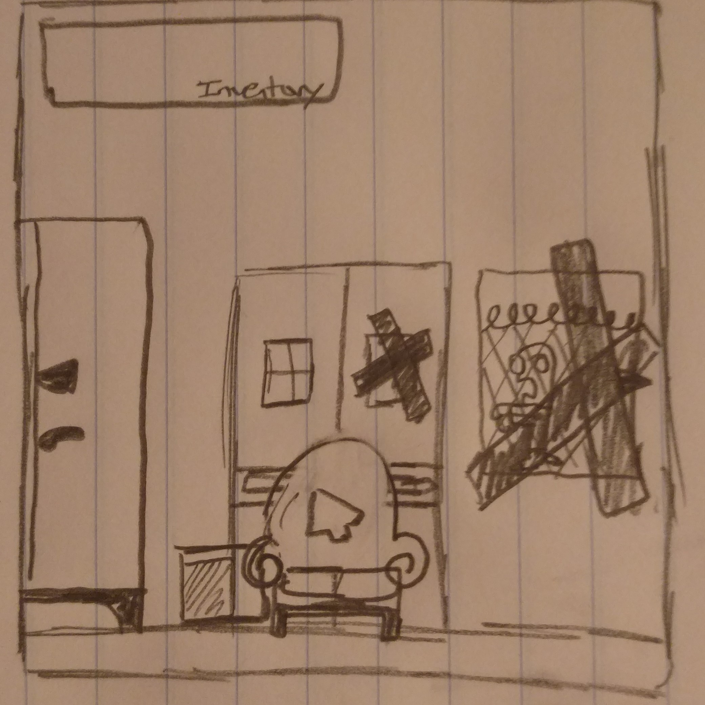
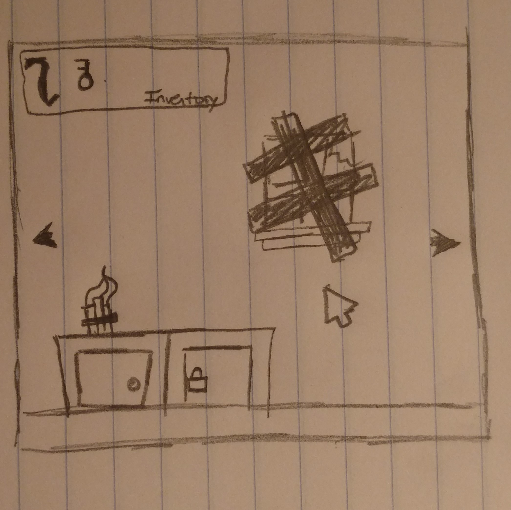

# Apocalypse Escape

##Concept:
##When your survival shelter is overrun by zombies undo your own defences to escape before the horde makes it to you.

##Genre: Point and Click, Adventure, Puzzle Game, Room Escape.

##Platform: Desktop Only

##Story Premise:
The zombie apocalypse has come. After the panic subsided and survivalistic life became normal, many different shelters and camps had risen. Yours has just become the horde's next target. As your shelter is overrun by zombies, undo your shelters defences to make your escape.

##Assets
Graphics will have a cartoon style.
Examples can be seen below.

Sound will be ambient noise, some background music and zombie noises so it does not seem to silent. There will also be sounds for item interactions, and button presses.

##Gameplay
The player will play the game with only the mouse. Using the cursor and left mouse button to find and uses items to solve puzzles. It will use a first person view and use room based rpg elements. There will be a countdown and if the player does not escape during the given time they will be eaten by the zombies.

The player is initially taught the game just by playing through. Getting the story's premise and controls explained through a title sequence and then thrown into the beginning of the game.
To beat the game the player will need to learn how to complete all the puzzles within the given time limit or their brains shall be devoured.

##About the Dev
My name is Stephen Rhodenizer, I am a Game Design and Development Major at RIT. I am skilled in game design, coding and cartoon style asset production. I am interested in video games, puzzles and board games. I hope you enjoy my take on the zombie fad and the room escape genre.